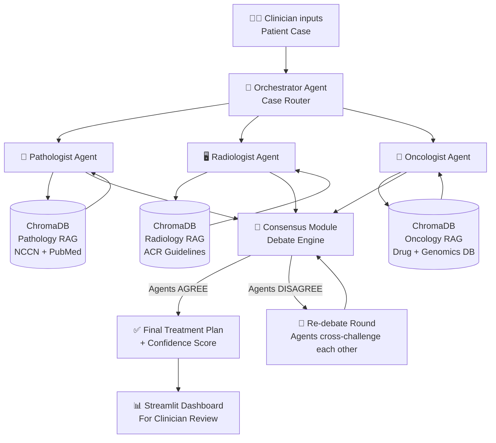
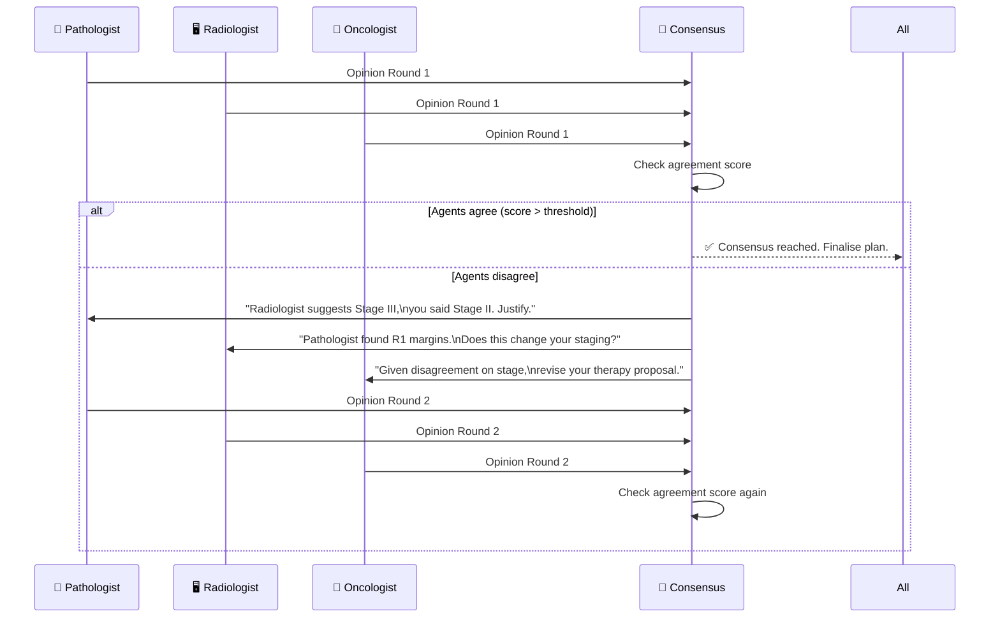

# OncoSwarm — Full Project Explanation

## The Big Picture (One Sentence)

> **OncoSwarm is a system where 3 specialized AI agents — a Pathologist, a Radiologist, and an Oncologist — receive a cancer patient's case, independently analyse it, debate their findings, and jointly produce a consensus treatment recommendation, mimicking a real hospital Multidisciplinary Tumor Board (MDT).**

---

## Why Does This Problem Exist?

In any major hospital, complex cancer cases go to a **Tumor Board** — a weekly meeting where a:
- 🔬 Pathologist reviews biopsy slides
- 🖥️ Radiologist reviews CT/MRI scans
- 💊 Oncologist reviews genomics + proposes treatment

Together they debate and agree on a plan. This is the **gold standard of cancer care**.

**The problem:** Most hospitals worldwide don't have enough specialists. Rural hospitals have zero access. Even top hospitals can only review ~20 cases/week.

**Our solution:** Simulate this entire process with AI agents running 24/7.

---

## End-to-End Flow



---

## The 5 Agents — Roles and Responsibilities

### 1. 🎯 Orchestrator Agent
- **What it does:** Receives the raw patient case (text vignette) and routes it to all specialist agents simultaneously. Also enforces structured output format.
- **How it works:** A LangGraph `StateGraph` node that manages message passing.
- **Input:** Raw clinical text (age, symptoms, biopsy report, CT findings, biomarkers, staging)
- **Output:** Structured patient object dispatched to all 3 specialists

---

### 2. 🔬 Pathologist Agent
- **Persona prompt:** *"You are a board-certified pathologist with 20 years of experience. You specialise in histopathological analysis of tumour biopsies..."*
- **Focus:** Biopsy reports, histology type, tumour grade, margins, Ki-67 index
- **RAG knowledge base:** NCCN pathology guidelines, WHO Classification of Tumours
- **Output:** Structured pathology opinion (`histology_type`, `grade`, `biomarker_status`, `key_concern`)

---

### 3. 🖥️ Radiologist Agent
- **Persona prompt:** *"You are a consultant radiologist specialising in oncologic imaging..."*
- **Focus:** CT/MRI/PET findings, tumour size, lymph node involvement, metastasis
- **RAG knowledge base:** ACR Radlex, RECIST criteria, TNM staging guidelines
- **Output:** Structured radiology opinion (`tumour_size`, `stage`, `metastasis`, `key_concern`)

---

### 4. 💊 Medical Oncologist Agent
- **Persona prompt:** *"You are a senior medical oncologist at a top cancer centre specialising in targeted therapy..."*
- **Focus:** Molecular/genomic results (EGFR, KRAS, HER2, PD-L1), systemic treatment selection
- **RAG knowledge base:** NCCN drug guidelines, OncoKB mutation database, approved drug list
- **Output:** Structured treatment opinion (`recommended_therapy`, `evidence_level`, `clinical_trial_options`, `key_concern`)

---

### 5. 🤝 Consensus Module (The Board)
This is the most novel part of OncoSwarm.



**Key mechanism:** The Consensus Module uses a structured **agreement score** — if the agents' treatment plans diverge (e.g., one says surgery, one says chemo), it forces another debate round where each agent must *respond to the others' objections*, exactly like a real MDT disagreement.

---

## RAG Pipeline — How Agents "Know" Medicine

Each agent has its own **vector database** (ChromaDB) loaded with:

```
Pathologist RAG:
  ├── WHO Classification of Tumours (PDFs)
  ├── NCCN Pathology Guidelines
  └── PubMed abstracts on histology subtypes

Radiologist RAG:
  ├── ACR Radlex guidelines
  ├── RECIST 1.1 criteria (response assessment)
  └── TNM staging manuals

Oncologist RAG:
  ├── NCCN Drug Guidelines (lung, breast, colon, etc.)
  ├── OncoKB — mutation → treatment mappings
  └── FDA-approved drug indications
```

**How it works:**
1. Agent receives a patient case
2. It generates a query: *"What is the first-line treatment for EGFR exon 19 deletion in stage IIIB NSCLC?"*
3. ChromaDB returns the top 3 relevant chunks from guidelines
4. The LLM synthesises an answer *grounded in that retrieved evidence*
5. Every claim is cited back to a source — no hallucination

---

## Data Flow (Concrete Example)

**Input Patient Case:**
```
Female, 58 years. Non-smoker. ECOG PS 1.
Biopsy: Lung adenocarcinoma, Grade 2, TTF-1 positive.
CT: 4.2cm right lower lobe mass, 2 ipsilateral mediastinal LN.
PET: No distant metastasis.
Biomarkers: EGFR exon 19 deletion (+), ALK (-), PD-L1 40%.
Stage: IIIA (T2bN2M0).
```

**Pathologist Agent output:**
```json
{
  "histology": "Lung adenocarcinoma (TTF-1+, Grade 2)",
  "biomarker": "EGFR exon 19 del (driver mutation confirmed)",
  "concern": "High-grade component — assess for micropapillary pattern"
}
```

**Radiologist Agent output:**
```json
{
  "stage": "IIIA (T2bN2M0)",
  "tumour_size": "4.2cm",
  "nodal": "Ipsilateral mediastinal involvement",
  "metastasis": "None detected",
  "concern": "Borderline resectability — MDT surgical opinion needed"
}
```

**Oncologist Agent output:**
```json
{
  "recommended_therapy": "Osimertinib (EGFR TKI, 1st-line, FLAURA trial)",
  "alternative": "Chemo-RT if surgical downstaging fails",
  "clinical_trial": "LAURA trial (osimertinib post-chemoradiation in stage III)",
  "evidence_level": "Category 1 (NCCN)"
}
```

**Consensus output:**
```
FINAL RECOMMENDATION:
Primary: Osimertinib 80mg OD (EGFR-targeted therapy) — Category 1 evidence
Rationale: Stage IIIA NSCLC with actionable EGFR exon 19 del. PD-L1 40% but 
EGFR mutation takes precedence per NCCN guidelines. Surgery not recommended 
given mediastinal LN involvement.
Confidence Score: 0.91 / 1.00
Agreement: Unanimous (3/3 agents)
```

---

## Evaluation — How We Prove It Works

| Metric | What it measures | How we compute it |
|---|---|---|
| **Consensus Accuracy** | Does our final plan match TCGA/NCCN ground truth? | Compare to published treatment guidelines for known cases |
| **Hallucination Rate** | How often does an agent fabricate a drug/fact? | Manual audit + automated fact-checking against RAG source |
| **Debate Convergence** | How many rounds until agents agree? | Average rounds across 100 synthetic cases |
| **Single LLM Baseline** | Does multi-agent beat single-prompt GPT-4? | A/B test on same case set |
| **Agent Agreement Score** | How often do all 3 agents agree on Round 1? | Percentage across full test set |

---

## Tech Stack

| Layer | Tool | Why |
|---|---|---|
| **Agent Orchestration** | LangGraph | Cyclic graph (debate loops), built-in state management |
| **LLM Backend** | Gemini 2.0 Flash (free API) | Fast, high context window, free tier sufficient |
| **RAG / Vector DB** | ChromaDB | Zero setup, in-memory, Colab-compatible |
| **Embeddings** | `text-embedding-004` (Google) | Free, fast |
| **Data** | TCGA (GDC Portal) + PMC-Patients | Rich histology + molecular + case narratives |
| **Dashboard** | Streamlit | Rapid deployment, shareable link |
| **Evaluation** | Custom Python + LangSmith | Trace agent reasoning steps |
| **Compute** | Google Colab (T4 / L4) | All API-based, no heavy GPU needed |

---

## What Makes This Novel / Publishable

| Feature | Status in Literature |
|---|---|
| Multi-agent debate with structured cross-examination | Partial (MDAT does voting; ours adds explicit critique loop) |
| Per-agent RAG with specialty-specific knowledge bases | Not done yet |
| Agreement score → automatic re-debate trigger | Novel |
| Hallucination quantification via debate | Novel |
| End-to-end evaluation on real TCGA cases | Not yet benchmarked in multi-agent context |

---

## Project Phases (16 Weeks)

```
Phase 1 (Wk 1-3):   Environment + Base paper replication (MDAT)
Phase 2 (Wk 4-6):   RAG pipelines per agent (ChromaDB + NCCN PDFs)
Phase 3 (Wk 7-9):   LangGraph orchestration + debate loop
Phase 4 (Wk 10-12): Evaluation on TCGA-LUAD synthetic vignettes
Phase 5 (Wk 13-14): Ablations (Single LLM vs. 2-agent vs. 3-agent)
Phase 6 (Wk 15-16): Streamlit Dashboard + Paper writing
```
