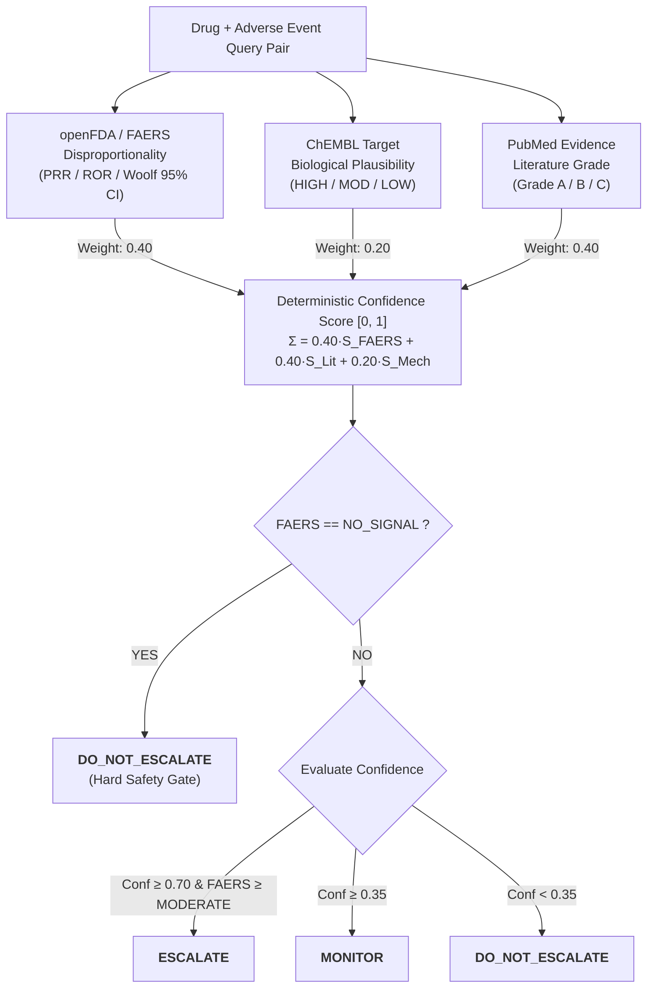

<div align="center">
  
  <h1>PharmaGuard</h1>
  <h3>Intelligent Pharmacovigilance Signal Triage Orchestrator Grounded in Multi-Source Clinical Evidence</h3>
  <p>
    <em>A Tool-Grounded, Tri-Source Evidence Fusion Agent for Postmarketing Adverse Event Triage</em><br>
    <em>B.Tech 7th-Semester Capstone Project · Indian Institute of Information Technology, Allahabad</em>
  </p>

  <p>
    <a href="https://www.python.org/"></a>
    <a href="https://streamlit.io/"></a>
    <a href="https://open.fda.gov/"></a>
    <a href="https://www.ebi.ac.uk/chembl/"></a>
    <a href="https://pubmed.ncbi.nlm.nih.gov/"></a>
    
  </p>
</div>

---

## The Problem

Every year, millions of spontaneous adverse drug event reports are submitted to postmarketing safety databases such as the **FDA Adverse Event Reporting System (FAERS)**. Clinical safety teams face an acute triage bottleneck: distinguishing true emergent pharmacological safety signals from background noise, uncorroborated reports, and confounded polypharmacy associations.

When generative foundation models (LLMs) are applied to clinical safety triage without strict tool grounding, they exhibit three fundamental failure modes:
1. **Hallucinated Clinical Confidence:** LLMs produce high, uncalibrated self-confidence scores without empirical statistical grounding.
2. **Historical Regulatory Confusion:** LLMs recall historical controversies that were investigated and formally dismissed by regulators (e.g. *liraglutide + pancreatic cancer*), confusing historical investigation with confirmed causation.
3. **Parametric Epistemic Leakage:** LLMs recall famous regulatory actions (e.g., FDA Boxed Warnings) directly from training memory, overriding biological mechanistic analysis with memorized clinical associations.

---

## Our Solution

**PharmaGuard** is an automated pharmacovigilance triage orchestrator that evaluates drug–adverse event pairs by synthesizing evidence from three orthogonal, public biomedical data streams:

- **1. openFDA / FAERS:** Computes postmarketing disproportionality statistics (2×2 contingency table, PRR, ROR, and Woolf 95% lower confidence bounds) with automatic down-weighting for wide confidence intervals.
- **2. ChEMBL Mechanism of Action:** Evaluates target-level pharmacological mechanisms to determine biological plausibility (`HIGH`, `MODERATE`, `LOW/UNKNOWN`) via human-curated lookup with agent-derived fallback.
- **3. PubMed Literature Retrieval:** Analyzes peer-reviewed abstracts using structured LLM grading against a versioned clinical rubric (`Grade A` for statistically significant odds ratios/CIs, `Grade B` for clinical observations, `Grade C` for unconfirmed/negative literature).

PharmaGuard synthesizes these signals via a **deterministic composite confidence formula** and applies a strict safety gate to output auditable decisions:
- **`ESCALATE`** — Statistically significant signal corroborated by high biological plausibility or Grade A literature.
- **`MONITOR`** — Genuine epidemiological signal with unconfirmed mechanism, or heavily confounded polypharmacy signal requiring clinical surveillance.
- **`DO_NOT_ESCALATE`** — No statistical postmarketing signal or dismissed non-causal association.



---

## Core Architectural Pillars

### 1. Tri-Source Grounded Evidence Fusion
PharmaGuard eliminates LLM guesswork by querying live/cached biomedical APIs:
- **FAERS Statistical Engine:** Computes exact Proportional Reporting Ratios (PRR) and Reporting Odds Ratios (ROR) from openFDA records. Signals with lower 95% CI < 1.0 are automatically downgraded to prevent small-sample false alarms.
- **ChEMBL Plausibility Layer:** Routes through curated lookup (`plausibility_ratings.json`) with agent-derived biochemical fallback.
- **PubMed Grading Pipeline:** Extracts statistical markers (p < 0.05, odds ratios, 95% CIs) to grade supporting peer-reviewed literature.

### 2. Deterministic Scoring & Hard Safety Gating

$$\text{Confidence} = 0.40 \cdot S_{\text{FAERS}} + 0.40 \cdot S_{\text{PubMed}} + 0.20 \cdot S_{\text{Plausibility}}$$

- **Hard Safety Gate:** If `FAERS == NO_SIGNAL`, the pipeline immediately outputs **`DO_NOT_ESCALATE`** regardless of confidence score. This prevents theoretical literature or biological speculation from triggering false alerts on drugs with zero real-world patient reports (`DECISIONS.md §5`).
- **Decision Boundaries:**
  - `Confidence >= 0.70` and `FAERS >= MODERATE` $\implies$ **`ESCALATE`**
  - `Confidence >= 0.35` $\implies$ **`MONITOR`**
  - Otherwise $\implies$ **`DO_NOT_ESCALATE`**

### 3. Dual-Metric Benchmark Framework (Strict vs. Lenient)
Evaluating signal triage requires capturing both unhesitating escalation and safety-critical surveillance:
- **Strict Metrics:** Treats only `ESCALATE` as True Positive. Captures epistemic caution when biological mechanism is unconfirmed (e.g. `montelukast::suicidal_ideation` $\to$ `MONITOR`, strictly recorded as `FN = 1`).
- **Lenient Metrics:** Treats `ESCALATE` and `MONITOR` as True Positive. Confirms that no safety-critical signal is dropped (`Recall = 1.000`).

### 4. Anti-Leakage & Memorization Probe Discipline
Empirical probing revealed that unconstrained LLM plausibility derivation (`force_agent` mode) produced an artificial 1.000 Strict Recall by leaking regulatory memory (citing FDA Boxed Warnings) rather than performing biochemical reasoning (`DECISIONS.md §19`). PharmaGuard maintains a `lookup_first` configuration and treats agent-derived plausibility as **grounded pharmacological knowledge retrieval and pathway synthesis**, not de novo reasoning (`DECISIONS.md §17`).

### 5. High-Density Streamlit Dashboard (Zero Live API Calls)
A presentation and clinical review dashboard engineered in Streamlit and Plotly with **zero live API dependencies at runtime**, reading exclusively from pre-committed evaluation reports with full confidence decomposition bar charts, inline report counts (`FAERS Signal (Count)`), and dynamic category filters.

---

## Benchmark & Evaluation Results

PharmaGuard was benchmarked against a **15-pair ground truth dataset** (7 Confirmed Positives, 5 Genuine Negative Controls, 3 Zero-Report Controls) and compared directly against a **Single-Shot LLM Baseline** (Gemini Flash, zero tool access):

| Metric | PharmaGuard (Tool-Grounded) | Single-Shot LLM Baseline (No Tools) | Benchmark Meaning & Significance |
| :--- | :---: | :---: | :--- |
| **Strict Precision** | **1.000** [0.610 – 1.000] | 0.875 [0.529 – 0.978] | **FP = 0** on negative controls under PharmaGuard. |
| **Strict Recall** | **0.857** (6/7) [0.487 – 0.974] | 1.000 (7/7) [0.646 – 1.000] | Strict FN = Montelukast (caution under unconfirmed mechanism). |
| **Strict Specificity** | **1.000** [0.676 – 1.000] | 0.875 [0.529 – 0.978] | Baseline falsely escalated *liraglutide* on historical concern. |
| **Strict F1 Score** | **0.923** [0.727 – 1.000] | 0.933 [0.769 – 1.000] | Robust F1 across strict binary escalation. |
| **Lenient Precision** | **0.875** [0.529 – 0.978] | 0.700 [0.397 – 0.892] | Confounded Metformin polypharmacy appropriately monitored. |
| **Lenient Recall** | **1.000** (7/7) [0.646 – 1.000] | 1.000 (7/7) [0.646 – 1.000] | **Zero safety signals missed** across both systems. |
| **Lenient Specificity** | **0.875** [0.529 – 0.978] | 0.625 [0.306 – 0.863] | PharmaGuard avoids over-monitoring clean negatives. |
| **Lenient F1 Score** | **0.933** [0.769 – 1.000] | 0.824 [0.615 – 0.941] | **+10.9% F1 gain** over single-shot baseline under lenient triage. |
| **Over-Caution Rate (OCR)** | **12.5%** (1 of 8) | **25.0%** (2 of 8) | **50% reduction in unnecessary negative control alerts.** |

*Note on Statistical CIs:* Non-parametric Bootstrap ($B=1000, \text{seed}=42$) and exact Wilson score 95% confidence intervals are reported. At $n=15$, the bootstrap $[1.000, 1.000]$ interval for strict precision/specificity is a mathematical $0/N$ boundary artifact; the Wilson interval ($[0.610, 1.000]$) reflects true small-sample uncertainty (`PROGRESS.md`, `DECISIONS.md §16`).

---

## Documented Case Studies

### 1. `montelukast` + `suicidal_ideation` (Confirmed Positive → `MONITOR`)
- **Evidence:** FAERS MODERATE (PRR = 3.37, 1,259 reports), PubMed Grade A (ROR statistics with 95% CIs).
- **Mechanism:** CysLT1 receptors are primarily peripheral; no direct CNS pathway is pharmacologically confirmed (`plausibility=LOW`).
- **Triage Result:** Composite confidence drops to 0.664 (< 0.70), yielding `MONITOR`.
- **Clinical Significance:** Pharmacovigilance-correct outcome: signals real-world co-occurrence while flagging unresolved mechanistic uncertainty.

### 2. `metformin` + `hypoglycaemia` (Negative Control → `MONITOR`)
- **Evidence:** FAERS STRONG (PRR = 10.73, 9,344 reports) due to widespread polypharmacy with insulin/sulfonylureas.
- **Mechanism:** Metformin inhibits hepatic gluconeogenesis without stimulating insulin secretion (`plausibility=LOW`, PubMed Grade C).
- **Triage Result:** The `0.40 * S_FAERS` term establishes a 0.400 confidence floor (>= 0.35), yielding `MONITOR`.
- **Clinical Significance:** Safety-first triage: discounts the confounded signal from `ESCALATE` down to `MONITOR`, preventing silent dropping when 9,000+ reports exist.

### 3. `liraglutide` + `pancreatic_cancer` (Negative Control → `DO_NOT_ESCALATE`)
- **Baseline vs. PharmaGuard:** The single-shot baseline confidently escalated based on recalled historical regulatory scrutiny. PharmaGuard checked live openFDA records, identified zero co-occurrence reports, and correctly applied the **`NO_SIGNAL` Hard Safety Gate** to return `DO_NOT_ESCALATE` (Confidence 0.300).

---

## Tech Stack

- **Core & Runtime:** Python 3.13, Pandas, NumPy, Scipy
- **Agent Orchestration:** LangGraph, LangChain, ReAct Agent Loop
- **Biomedical APIs & Parsing:** openFDA REST API, ChEMBL Web Resource Client, NCBI E-utilities (BioC / Entrez)
- **Caching Layer:** `diskcache` (persistent disk-backed cache with SHA-256 deterministic keying)
- **Statistical Evaluation:** Non-parametric Bootstrap Resampling ($B=1000$), Wilson Score Binomial Confidence Intervals
- **Clinical Dashboard:** Streamlit 1.61, Plotly Express & Graph Objects

---

## Repository Structure

```
PharmaGuard/
├── .agents/skills/                   # Antigravity agent skills
│   ├── developing-with-streamlit/    # Streamlit UI & component patterns
│   ├── pharmacovigilance-evaluation/ # Codified statistical evaluation protocols
│   ├── academic-paper-writer/        # Academic manuscript drafting scaffold
│   └── presentation-deck-builder/    # 16:9 defense slide deck scaffold
├── configs/
│   └── config.yaml                   # Central pipeline & cache configuration
├── docs/
│   ├── context/
│   │   ├── UNDERSTAND.md             # Canonical plain-language project overview
│   │   ├── DECISIONS.md              # 22-section chronological record of architectural decisions
│   │   ├── PROGRESS.md               # Sprint log, verified metrics & reproduction steps
│   │   ├── ARCHITECTURE.md           # Technical system & schema specifications
│   │   └── CONVENTIONS.md            # Coding standards & git workflow
│   └── screenshots/dashboard/        # High-resolution dashboard verification captures
├── outputs/
│   ├── eval-run-*_report.json        # 15 production pipeline evaluation JSON reports
│   ├── evaluation_summary.txt        # Production benchmark summary with 95% CIs
│   ├── baseline/                     # Single-shot LLM baseline reports & summary
│   ├── ablation/                     # force_agent mode ablation reports & comparison
│   └── probe/                        # Obscure-pair memorization probe reports
├── pharmaguard/
│   ├── agent/                        # ReAct & Fixed Pipeline agents
│   ├── data/
│   │   ├── ground_truth.json         # 15 curated benchmark evaluation pairs
│   │   └── plausibility_ratings.json # Human-curated plausibility ratings (v1.0)
│   ├── prompts/                      # Versioned system prompts & grading rubrics
│   ├── tools/                        # OpenFDA, ChEMBL, PubMed & diskcache tools
│   └── utils/                        # Config loaders, normalizers & metrics
├── scripts/
│   ├── dashboard.py                  # Streamlit evaluation dashboard driver
│   ├── dashboard_modules/            # Modular dashboard package (views, components, styles)
│   ├── run_eval.py                   # 15-pair benchmark evaluation runner
│   ├── evaluator.py                  # Strict & Lenient metric calculator with Bootstrap/Wilson CIs
│   ├── baseline.py                   # Single-shot LLM baseline evaluation runner
│   ├── run_probe.py                  # Memorization probe runner
│   ├── check_albuterol.py            # FAERS verification diagnostic
│   └── verify_reports.py             # Output schema & UTF-8 integrity diagnostic
├── tests/                            # 51 pytest unit & regression tests
├── requirements.txt                  # Pinned project dependencies
├── README.md                         # Project entry point & overview
└── UNDERSTAND.md                     # Root pointer to docs/context/UNDERSTAND.md
```

---

## Quickstart & Reproduction

### 1. Installation

```bash
# Clone the repository
git clone https://github.com/Krishna200608/PharmaGuard.git
cd PharmaGuard

# Create and activate virtual environment
python -m venv .venv

# Windows (PowerShell)
.\.venv\Scripts\Activate.ps1
# Linux / macOS
# source .venv/bin/activate

# Install dependencies
pip install -r requirements.txt

# Configure environment keys (copy .env.example)
cp .env.example .env
# Edit .env and add GOOGLE_API_KEY and NCBI_API_KEY
```

### 2. Run the Full Evaluation Pipeline

```bash
# Run 15-pair evaluation against openFDA, ChEMBL, and PubMed
python scripts/run_eval.py

# Compute Strict and Lenient evaluation metrics with 95% CIs
python scripts/evaluator.py --outputs-dir outputs --title "PharmaGuard Final"

# Run single-shot baseline evaluation
python scripts/baseline.py
```

### 3. Launch the Evaluation Dashboard

```bash
streamlit run scripts/dashboard.py
```
*The dashboard opens at `http://localhost:8501`, rendering all 4 views (Overview, Per-Pair Table, Disagreement Spotlight, Baseline Comparison) with zero live network calls.*

### 4. Run Unit Tests

```bash
pytest -v
```

---

## Documentation Roadmap

| Document | Purpose & Description |
| :--- | :--- |
| **[`docs/context/UNDERSTAND.md`](docs/context/UNDERSTAND.md)** | **Start here.** Plain-language guide covering system mechanics, data streams, and the dual-metric philosophy. |
| **[`docs/context/DECISIONS.md`](docs/context/DECISIONS.md)** | Complete 22-section chronological record of all architectural decisions, MedDRA PT audits, and memorization probe findings. |
| **[`docs/context/PROGRESS.md`](docs/context/PROGRESS.md)** | Sprint changelog, exact Wilson/Bootstrap confidence interval tables, and clean reproduction verification. |
| **[`docs/context/ARCHITECTURE.md`](docs/context/ARCHITECTURE.md)** | Formal technical architecture, component interactions, scoring equations, and JSON schemas. |

---

## Authors & Acknowledgments

- **Author:** [Krishna Sikheriya](https://github.com/Krishna200608) (IIT2023139) — *Lead Developer & AI Architect*
- **Supervisor:** **Dr. Nikhilanand Arya** — *Assistant Professor, Department of Information Technology, IIIT Allahabad*
- **Institution:** Indian Institute of Information Technology, Allahabad (IIIT-A)
- **Academic Milestone:** 7th-Semester B.Tech IT Capstone Project (2026–2027)

---

## License

This project is licensed under the [MIT License](LICENSE).
