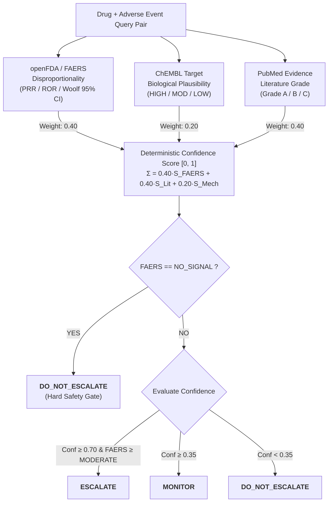

<div align="center">
  
  <h1>PharmaGuard</h1>
  <h3>Intelligent Pharmacovigilance Signal Triage Orchestrator Grounded in Multi-Source Clinical Evidence</h3>
  <p>
    <em>A Tool-Grounded, Tri-Source Evidence Fusion Agent for Postmarketing Adverse Event Triage</em><br>
    <em>B.Tech 7th-Semester Capstone Project · Indian Institute of Information Technology, Allahabad</em>
  </p>

  <p>
    <a href="https://www.python.org/"></a>
    <a href="https://streamlit.io/"></a>
    <a href="https://open.fda.gov/"></a>
    <a href="https://www.ebi.ac.uk/chembl/"></a>
    <a href="https://pubmed.ncbi.nlm.nih.gov/"></a>
    
    
  </p>
</div>

---

## The Problem

Every year, millions of spontaneous adverse drug event reports are submitted to postmarketing safety databases such as the **FDA Adverse Event Reporting System (FAERS)**. Clinical safety teams face an acute triage bottleneck: distinguishing true emergent pharmacological safety signals from background noise, uncorroborated reports, and confounded polypharmacy associations.

When generative foundation models (LLMs) are applied to clinical safety triage without strict tool grounding, they exhibit three fundamental failure modes:
1. **Hallucinated Clinical Confidence:** LLMs produce high, uncalibrated self-confidence scores without empirical statistical grounding.
2. **Historical Regulatory Confusion:** LLMs recall historical controversies that were investigated and formally dismissed by regulators (e.g. *liraglutide + pancreatic cancer*), confusing historical investigation with confirmed causation.
3. **Parametric Epistemic Leakage:** LLMs recall famous regulatory actions (e.g., FDA Boxed Warnings) directly from training memory, overriding biological mechanistic analysis with memorized clinical associations.

---

## Our Solution

**PharmaGuard** is an automated pharmacovigilance triage orchestrator that evaluates drug–adverse event pairs by synthesizing evidence from three orthogonal, public biomedical data streams:

- **1. openFDA / FAERS:** Computes postmarketing disproportionality statistics (2×2 contingency table, PRR, ROR, and Woolf 95% lower confidence bounds) with automatic down-weighting for wide confidence intervals.
- **2. ChEMBL Mechanism of Action:** Evaluates target-level pharmacological mechanisms to determine biological plausibility (`HIGH`, `MODERATE`, `LOW/UNKNOWN`) via human-curated lookup with agent-derived fallback.
- **3. PubMed Literature Retrieval:** Analyzes peer-reviewed abstracts using structured LLM grading against a versioned clinical rubric (`Grade A` for statistically significant odds ratios/CIs, `Grade B` for clinical observations, `Grade C` for unconfirmed/negative literature).

PharmaGuard synthesizes these signals via a **deterministic composite confidence formula** and applies a strict safety gate to output auditable decisions:
- **`ESCALATE`** — Statistically significant signal corroborated by high biological plausibility or Grade A literature.
- **`MONITOR`** — Genuine epidemiological signal with unconfirmed mechanism, or heavily confounded polypharmacy signal requiring clinical surveillance.
- **`DO_NOT_ESCALATE`** — No statistical postmarketing signal or dismissed non-causal association.



---

## Core Architectural Pillars

### 1. Tri-Source Grounded Evidence Fusion
PharmaGuard eliminates LLM guesswork by querying live/cached biomedical APIs:
- **FAERS Statistical Engine:** Computes exact Proportional Reporting Ratios (PRR) and Reporting Odds Ratios (ROR) from openFDA records. Signals with lower 95% CI < 1.0 are automatically downgraded to prevent small-sample false alarms.
- **ChEMBL Plausibility Layer:** Routes through curated lookup (`plausibility_ratings.json`) with agent-derived biochemical fallback.
- **PubMed Grading Pipeline:** Extracts statistical markers (p < 0.05, odds ratios, 95% CIs) to grade supporting peer-reviewed literature.

### 2. Deterministic Scoring & Hard Safety Gating

$$\text{Confidence} = 0.40 \cdot S_{\text{FAERS}} + 0.40 \cdot S_{\text{PubMed}} + 0.20 \cdot S_{\text{Plausibility}}$$

- **Hard Safety Gate:** If `FAERS == NO_SIGNAL`, the pipeline immediately outputs **`DO_NOT_ESCALATE`** regardless of confidence score. This prevents theoretical literature or biological speculation from triggering false alerts on drugs with zero real-world patient reports (`DECISIONS.md §5`).
- **Decision Boundaries:**
  - `Confidence >= 0.70` and `FAERS >= MODERATE` $\implies$ **`ESCALATE`**
  - `Confidence >= 0.35` $\implies$ **`MONITOR`**
  - Otherwise $\implies$ **`DO_NOT_ESCALATE`**

### 3. Dual-Metric Benchmark Framework (Strict vs. Lenient)
Evaluating signal triage requires capturing both unhesitating escalation and safety-critical surveillance:
- **Strict Metrics:** Treats only `ESCALATE` as True Positive. Captures epistemic caution when biological mechanism is unconfirmed (e.g. `montelukast::suicidal_ideation` $\to$ `MONITOR`, strictly recorded as `FN = 1`).
- **Lenient Metrics:** Treats `ESCALATE` and `MONITOR` as True Positive. Confirms that no safety-critical signal is dropped (`Recall = 1.000` on Core 15 pairs).

### 4. Anti-Leakage & Memorization Probe Discipline
Empirical probing revealed that unconstrained LLM plausibility derivation (`force_agent` mode) produced an artificial 1.000 Strict Recall by leaking regulatory memory (citing FDA Boxed Warnings) rather than performing biochemical reasoning (`DECISIONS.md §19`). PharmaGuard maintains a `lookup_first` configuration and treats agent-derived plausibility as **grounded pharmacological knowledge retrieval and pathway synthesis**, not de novo reasoning (`DECISIONS.md §17`).

### 5. High-Density Streamlit Dashboard (Zero Live API Calls)
A clinical review dashboard engineered in Streamlit and Plotly with **zero live API dependencies at runtime** across **6 dedicated views** (Overview, Per-Pair Table, Disagreement Spotlight, Baseline Comparison, Methodology Probes, and OMOP Pilot Benchmark), reading exclusively from pre-committed evaluation reports with full confidence decomposition waterfall and stacked bar charts, inline report count badges (`FAERS Signal (Count)`), and dynamic category filters.

### 6. Disease-Context Reasoning & Scoring-Inert Indication Concordance
To address confounding by indication—where a drug is prescribed for symptoms overlapping the suspected adverse event—PharmaGuard incorporates specialized clinical context modules:
- **`DiseaseContextTool` & WHO ATC:** Queries the ChEMBL API and local registries (`atc_lookup.json`) for WHO Anatomical Therapeutic Chemical (ATC) classification codes (Levels 1–4) and indication records to contextualize disease space.
- **`IndicationConcordanceTool`:** Evaluates semantic and pharmacological concordance between candidate adverse events and indicated pathologies using a 7-rule clinical heuristics cascade (`IND-CONF-01` to `IND-CONF-07`).
- **Scoring-Inert by Design:** In production triage, indication concordance operates strictly as an **informational surveillance flag** without modifying composite numerical confidence or causing decision boundary crossings (`DECISIONS.md §35`). This deliberate scoring-inert separation provides clinical reviewers with vital confounding context while preserving the mathematical determinism and safety-gate integrity of the core triage engine.

---

## Multi-Benchmark Performance Results

PharmaGuard has been evaluated across two formal benchmark suites: the **Core 15-Pair Ground Truth Benchmark** (7 Confirmed Positives, 5 Genuine Negative Controls, 3 Zero-Report Controls) evaluated against a **Single-Shot LLM Baseline** (Gemini 3.1 Flash Lite, zero tool access), and the external **OMOP Pilot Benchmark** (32 pairs from the OHDSI MethodEvaluation reference set across 4 acute clinical outcomes: AMI, Acute Pancreatitis, Upper GI Bleed, and Acute Liver Injury):

| Benchmark & Evaluation Suite | Strict Precision | Strict Recall | Strict Specificity | Strict F1 | Lenient Precision | Lenient Recall | Lenient Specificity | Lenient F1 | Over-Caution Rate |
| :--- | :---: | :---: | :---: | :---: | :---: | :---: | :---: | :---: | :---: |
| **PharmaGuard (Core 15-Pair)** | **1.000** [0.610 – 1.000] | **0.857** (6/7) [0.487 – 0.974] | **1.000** [0.676 – 1.000] | **0.923** [0.727 – 1.000] | **0.875** [0.529 – 0.978] | **1.000** (7/7) [0.646 – 1.000] | **0.875** [0.529 – 0.978] | **0.933** [0.769 – 1.000] | **12.5%** (1 of 8) |
| **Single-Shot Baseline (Core 15-Pair)** | 0.875 [0.529 – 0.978] | 1.000 (7/7) [0.646 – 1.000] | 0.875 [0.529 – 0.978] | 0.933 [0.769 – 1.000] | 0.700 [0.397 – 0.892] | 1.000 (7/7) [0.646 – 1.000] | 0.625 [0.306 – 0.863] | 0.824 [0.615 – 0.941] | 25.0% (2 of 8) |
| **PharmaGuard (OMOP Pilot 32-Pair)** | **1.000** (1/1) [0.207 – 1.000] | **0.063** (1/16) [0.011 – 0.270] | **1.000** (16/16) [0.806 – 1.000] | **0.118** [0.024 – 0.426] | **0.846** (11/13) [0.578 – 0.957] | **0.688** (11/16) [0.444 – 0.858] | **0.813** (13/16) [0.570 – 0.934] | **0.720** [0.540 – 0.850] | **18.8%** (3 of 16) |

*Statistical Confidence Intervals:* Wilson score and non-parametric Bootstrap ($B=1000, \text{seed}=42$) 95% confidence intervals are reported. Under strict triage on OMOP Pilot, PharmaGuard achieved **100% Specificity (16/16 negative controls correctly suppressed)**. Under lenient triage, it captured **68.8% Recall (11/16 positive controls placed under surveillance)** with only a minor 18.8% over-caution rate.

> **Exploratory 40-Pair Held-Out OMOP Validation Batch:**
> In addition to the primary benchmarks above, an exploratory batch of 40 held-out OMOP pairs (20 positive controls, 20 negative controls) was curated to evaluate whether an active indication-concordance discount factor ($\delta = 0.85$) would safely attenuate confounded disproportionality signals without destabilizing decision thresholds. In this batch, concordance criteria triggered on only 4 of the 40 pairs (10.0%)—far too few to establish statistically powered conclusions regarding the discount's generalization across broad clinical phenotypes. While the discount lowered confidence sub-scores as mathematically designed without violating any hard safety gates, it caused zero decision boundary crossings ($\Delta = 0$). The experiment and full per-pair audit are documented as an exploratory negative result in [`docs/context/DECISIONS.md §38`](docs/context/DECISIONS.md#38-independent-verification-and-factual-correction-of-the-40-pair-held-out-omop-validation-batch).

---

## Documented Case Studies

### 1. `montelukast` + `suicidal_ideation` (Confirmed Positive → `MONITOR`)
- **Evidence:** FAERS MODERATE (PRR = 3.37, 1,259 reports), PubMed Grade A (ROR statistics with 95% CIs).
- **Mechanism:** CysLT1 receptors are primarily peripheral; no direct CNS pathway is pharmacologically confirmed (`plausibility=LOW`).
- **Triage Result:** Composite confidence drops to 0.664 (< 0.70), yielding `MONITOR`.
- **Clinical Significance:** Pharmacovigilance-correct outcome: signals real-world co-occurrence while flagging unresolved mechanistic uncertainty.

### 2. `metformin` + `hypoglycaemia` (Negative Control → `MONITOR`)
- **Evidence:** FAERS STRONG (PRR = 10.73, 9,344 reports) due to widespread polypharmacy with insulin/sulfonylureas.
- **Mechanism:** Metformin inhibits hepatic gluconeogenesis without stimulating insulin secretion (`plausibility=LOW`, PubMed Grade C).
- **Triage Result:** The `0.40 * S_FAERS` term establishes a 0.400 confidence floor (>= 0.35), yielding `MONITOR`.
- **Clinical Significance:** Safety-first triage: discounts the confounded signal from `ESCALATE` down to `MONITOR`, preventing silent dropping when 9,000+ reports exist.

### 3. `liraglutide` + `pancreatic_cancer` (Negative Control → `DO_NOT_ESCALATE`)
- **Baseline vs. PharmaGuard:** The single-shot baseline confidently escalated based on recalled historical regulatory scrutiny. PharmaGuard checked live openFDA records, identified zero co-occurrence reports, and correctly applied the **`NO_SIGNAL` Hard Safety Gate** to return `DO_NOT_ESCALATE` (Confidence 0.300).

---

## Tech Stack

- **Core & Runtime:** Python 3.13, Pandas, NumPy, Scipy
- **Agent Orchestration:** LangGraph, LangChain, ReAct Agent Loop
- **Biomedical APIs & Parsing:** openFDA REST API, ChEMBL Web Resource Client, NCBI E-utilities (BioC / Entrez)
- **Caching Layer:** `diskcache` (persistent disk-backed cache with SHA-256 deterministic keying)
- **Statistical Evaluation:** Non-parametric Bootstrap Resampling ($B=1000$), Wilson Score Binomial Confidence Intervals
- **Clinical Dashboard:** Streamlit 1.61, Plotly Express & Graph Objects

---

## Repository Structure

```
PharmaGuard/
├── .agents/skills/                   # Antigravity agent skills & evaluation protocols
├── assets/
│   ├── Logos/                        # Vector and raster brand identity assets
│   └── Screenshots/                  # High-resolution dashboard verification captures (Light & Dark)
├── configs/
│   └── config.yaml                   # Central pipeline, model, scoring, and cache configuration
├── docs/
│   ├── context/                      # Core architectural, historical, and engineering documentation
│   │   ├── UNDERSTAND.md             # Canonical plain-language project overview
│   │   ├── DECISIONS.md              # 38-section chronological record of architectural decisions
│   │   ├── PROGRESS.md               # Sprint changelog, verified metrics & reproduction steps
│   │   └── ARCHITECTURE.md           # Exhaustive technical system & Pydantic schema specifications
│   ├── meetings/                     # Weekly stakeholder progress updates and briefing memos
│   └── proposals/                    # Formal capstone proposals & institutional briefs
├── outputs/
│   ├── core/                         # Frozen production TriageReport JSONs (15 pairs) + summary
│   ├── experiments/                  # Isolated experimental conditions (baseline/, react_agent/, and several isolated experiment directories)
│   └── research/                     # Formal research benchmarks & artifacts (omop_pilot/, stability/, paper_figures/, and reproducibility manifests)
├── pharmaguard/
│   ├── agent/                        # Fixed Pipeline & ReAct LangGraph orchestrators, schemas
│   ├── data/                         # Benchmark pairs, plausibility ratings, ChEMBL & ATC registries
│   ├── prompts/                      # Versioned system prompts & grading rubrics
│   ├── tools/                        # FAERS, ChEMBL, PubMed, Confounding, DiseaseContext, IndicationConcordance tools & cache
│   └── utils/                        # Config loaders, normalizers & evaluation metrics
├── scripts/
│   ├── dashboard.py                  # Streamlit evaluation dashboard driver (6 views)
│   ├── dashboard_modules/            # Modular dashboard package (views, components, styles)
│   ├── run_eval.py                   # Production 15-pair benchmark evaluation runner
│   ├── evaluator.py                  # Strict & Lenient metric calculator with Bootstrap/Wilson CIs
│   ├── baseline.py                   # Single-shot LLM baseline evaluation runner
│   ├── dev/                          # Developer diagnostic and verification utilities
│   └── research/                     # Specialized research runners (OMOP pilot, probes, stability, ablation)
├── tests/                            # 229 pytest unit & regression tests (all passing)
├── requirements.txt                  # Pinned project dependencies
├── NOTICE.md                         # Third-party licenses (CC BY-SA 3.0, Apache 2.0) & citations
├── LICENSE                           # Project MIT License
└── README.md                         # Project entry point & overview
```

*(For an exhaustive breakdown of all output subdirectories, research harnesses, and JSON schemas, see [`docs/context/ARCHITECTURE.md`](docs/context/ARCHITECTURE.md).)*

---

## Quickstart & Reproduction

### 1. Installation

```bash
# Clone the repository
git clone https://github.com/Krishna200608/PharmaGuard.git
cd PharmaGuard

# Create and activate virtual environment
python -m venv .venv

# Windows (PowerShell)
.\.venv\Scripts\Activate.ps1
# Linux / macOS
# source .venv/bin/activate

# Install dependencies
pip install -r requirements.txt

# Configure environment keys (copy .env.example)
cp .env.example .env
# Edit .env and add GOOGLE_API_KEY and NCBI_API_KEY
```

### 2. Run the Full Evaluation Pipeline

```bash
# Run 15-pair evaluation against openFDA, ChEMBL, and PubMed
python scripts/run_eval.py

# Compute Strict and Lenient evaluation metrics with 95% CIs
python scripts/evaluator.py --outputs-dir outputs/core --title "PharmaGuard Final"

# Run single-shot baseline evaluation
python scripts/baseline.py
```

### 3. Launch the Evaluation Dashboard

```bash
streamlit run scripts/dashboard.py
```
*The dashboard opens at `http://localhost:8501`, rendering all 6 views (Overview, Per-Pair Table, Disagreement Spotlight, Baseline Comparison, Methodology Probes, and OMOP Pilot Benchmark) with zero live network calls.*

### 4. Run Unit Tests

```bash
pytest -v
```
*(All 229 tests pass across 18 test modules in ~48s).*

---

## Documentation Roadmap

| Document | Purpose & Description |
| :--- | :--- |
| **[`docs/context/UNDERSTAND.md`](docs/context/UNDERSTAND.md)** | **Start here.** Plain-language guide covering system mechanics, data streams, and the dual-metric philosophy. |
| **[`docs/context/DECISIONS.md`](docs/context/DECISIONS.md)** | Complete 38-section chronological record of all architectural decisions, MedDRA PT audits, probe findings, and benchmark validations. |
| **[`docs/context/PROGRESS.md`](docs/context/PROGRESS.md)** | Sprint changelog, multi-benchmark results, exact Wilson/Bootstrap confidence interval tables, and reproduction verification. |
| **[`docs/context/ARCHITECTURE.md`](docs/context/ARCHITECTURE.md)** | Exhaustive technical system architecture, data flows, Pydantic schemas, mathematical scoring equations, and directory tree. |
| **[`docs/context/CONTRIBUTION.md`](docs/context/CONTRIBUTION.md)** | Grounded claims of project contributions, empirical findings, and architectural comparisons. |
| **[`docs/proposals/PharmaGuard_Proposal_2026-08-18.md`](docs/proposals/PharmaGuard_Proposal_2026-08-18.md)** | Formal Capstone Project Proposal (18 August 2026) submitted to Dr. Nikhilanand Arya. |

---

## Authors & Acknowledgments

- **Team:**
  - **[Krishna Sikheriya](https://github.com/Krishna200608)** (IIT2023139) — *Leader*
  - **Lokesh Bawariya** (IIT2023138)
  - **Naitik Jain** (IIB2023036)
- **Supervisor:** **[Dr. Nikhilanand Arya](https://scholar.google.com/citations?user=hBf6EmgAAAAJ&hl=en)** — *Assistant Professor, Department of Information Technology, IIIT Allahabad*
- **Institution:** Indian Institute of Information Technology, Allahabad (IIIT-A)
- **Academic Milestone:** 7th-Semester B.Tech Capstone Project (2026–2027)

---

## License & Third-Party Notices

- **Software & Code:** PharmaGuard's original software, agent orchestration, evaluation harnesses, and documentation are licensed under the [MIT License](LICENSE).
- **Third-Party Data & Lookups:** Certain pharmacological registries and benchmark datasets distributed in `pharmaguard/data/` are governed by open third-party licenses:
  - `pharmaguard/data/chembl_lookup.json` and `pharmaguard/data/atc_lookup.json` are derived from the EMBL-EBI ChEMBL database and licensed under [CC BY-SA 3.0](https://creativecommons.org/licenses/by-sa/3.0/) (Creative Commons Attribution-ShareAlike 3.0 Unported). In accordance with the ShareAlike clause, these data files remain subject to CC BY-SA 3.0 and are not covered by the repo's MIT license.
  - `pharmaguard/data/external/omopReferenceSet.rda` and the derived benchmark files `pharmaguard/data/ground_truth_omop_pilot.json` and `pharmaguard/data/ground_truth_omop_validation_holdout.json` are distributed under the [Apache License 2.0](http://www.apache.org/licenses/LICENSE-2.0) (OHDSI MethodEvaluation).

See **[`NOTICE.md`](NOTICE.md)** for full third-party license texts, copyright notices, and required academic citations.


